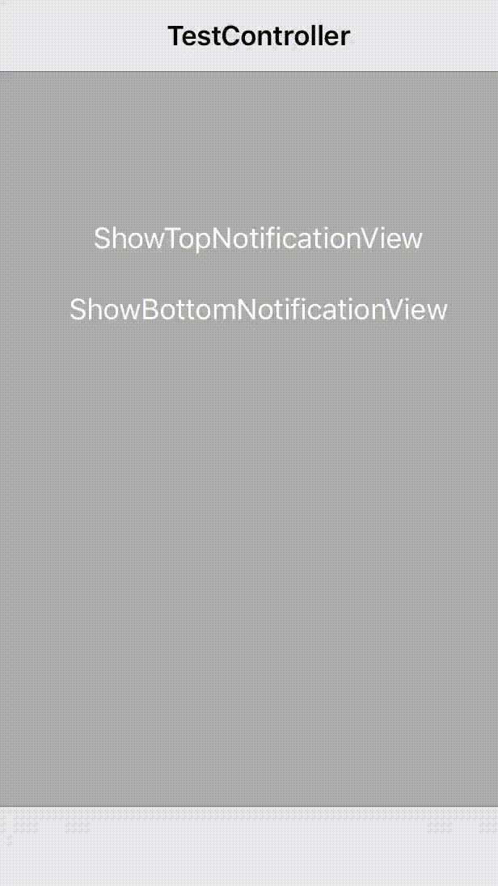

# YZNotificationView
IOS framework to show simple notification view above NavigationBar or TabBar

## Features
- Swift 4.2.
- Show top or botton notificaiton view above UIViewController which can be contain UINavigationBar or UITabBar.
- Only vertical landscape

## Setup

**import YZNotificationView**

After that you need to create worker, it is a singleton

**let notificationManager = YZNotificationManager.sharedInstance**

And now you can show notificaion view on top

**let text = "Hi! \nI am top"**
**let notificationView = YZNotificationView(text: text, image: nil, position: .topPosition)**
**notificationManager.showNotifiationView(notificationView)**

Or on bottom

**let text = "Hi! I am bottom"**
**let notificationView = YZNotificationView(text: "Hi! I am bottom", image: nil, position: .bottomPosition)**
**notificationManager.showNotifiationView(notificationView)**

Also it is full of customization

**var config = YZNotificationViewConfig()**
**config.imageViewBackgroundColor = .yellow**
**config.textColor = .red**
**config.textAlignment = .right**
**config.textFont = UIFont.systemFont(ofSize: 17)**
**config.isAutoClose = false**
**config.animationDuration = TimeInterval(0.75)**
**config.displayDuration = TimeInterval(1.75)**
**config.defaultOffset = 10**
**let notificationView = YZNotificationView(text: "Hi! I am bottom", image: nil, position: .bottomPosition, configuration: config)**
**notificationManager.showNotifiationView(notificationView)**

Find the above displayed examples in the example.

## Instalation
### Cocoapods

To install it, simply add the following line to your Podfile:

pod 'YZNotificationView', :git => 'https://github.com/YarZav/YZNotificationView.git', :branch => 'master'

## Feedback

Feel free to create a pull request.

